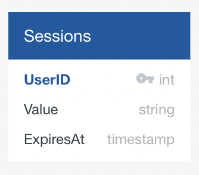
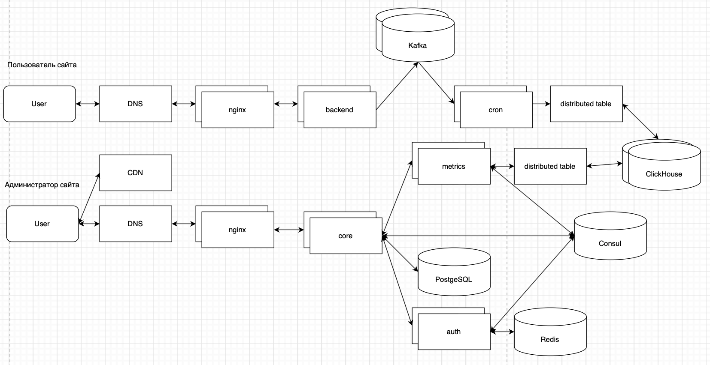

# Тема проекта - Яндекс Метрика

## 1. Тема и целевая аудитория

### MVP

1. Регистрация администратора
2. Авторизация администратора
3. Регистрация сайта
4. Сбок метрик сайта (сырые метрики без отчетов)
5. Просмотр метрик сайта

### Целевая аудитория

* У Яндекс Метрики целевая аудитория - владельцы сайтов, которые хотят собирать статистику.
* Яндекс Метрика установлена на 6.7 % всех сайтов в интернете. [На 2020 в интернете примерно 1.8 млд сайтов](https://sdvv.ru/articles/elektronnaya-kommertsiya/statistika-interneta-2020-sayty-domeny-khosting-trafik/), значит Яндекс Метрика установлена примерно на 120 млн сайтов.
* Сервисом пользуются по всему миру. В основном используют в Европе и РФ [3 по популярности система веб аналитики в Европе](https://w3techs.com/technologies/details/ta-yandexmetrika)

## 2. Расчет нагрузки

### Продуктовые метрики

1. **Количество сайтов** - 120 млн

2. **Термины**

    * Администратор - владелец сайта
    * Клиент - пользователь сайта
    * Метрики - информация о клиентах и их посещениях. Метрики клиента будет считать в хитах

3. **Средний размер хранилища администратора**
    * Профиль

    | Данные           | Размер |
    | ---------------- | ------ |
    | ID               | 5 Б    |
    | Name             | 5 Б    |
    | Login            | 5 Б    |
    | Password         | 5 Б    |
    | **Общий размер** | 20 Б   |

    * Информация о сайте

    | Данные           | Размер |
    | ---------------- | ------ |
    | ID               | 5 Б    |
    | Name             | 5 Б    |
    | Domen            | 5 Б    |
    | CounterNumber    | 5 Б    |
    | **Общий размер** | 20 Б   |

4. **Средний размер хранилища клиента**
    * Информация о клиенте

    | Общие данные               | Размер |
    | -------------------------- | ------ |
    | ClienID                    | 5 Б    |
    | Возраст                    | 5 Б    |
    | Пол                        | 5 Б    |
    | Первый визит               | 10 Б   |
    | Последний визит            | 10 Б   |
    | Количество визитов         | 5 Б    |
    | Общее время на сайте       | 10 Б   |
    | **Общий размер**           | 50 Б   |

    * Информация о клиенте за 1 хит

    | Данные каждого хита   | Размер |
    | --------------------- | ------ |
    | ClienID               | 10 Б   |
    | Номер визита          | 10 Б   |
    | Таймзона              | 10 Б   |
    | Дата визита           | 10 Б   |
    | Время визита          | 10 Б   |
    | Время на сайте        | 10 Б   |
    | Источник трафика      | 10 Б   |
    | Домен                 | 10 Б   |
    | URL                   | 10 Б   |
    | Страна                | 10 Б   |
    | Регион                | 10 Б   |
    | Операционная система  | 10 Б   |
    | Браузер               | 10 Б   |
    | Язык браузера         | 10 Б   |
    | Разрешение экрана     | 10 Б   |
    | User Agent            | 10 Б   |
    | IP                    | 10 Б   |
    | Тип устройства        | 10 Б   |
    | Модель устройства     | 10 Б   |
    | Событие               | 10 Б   |
    | Общий размер          | 200 Б  |

    Это не все метрики, которые приходят. Я выделил основные, болше данных можно посмотреть [тут](https://play.clickhouse.com). В среднем клиент на сайте совершает 1,5 хита в день. Подсчитаем нагрузку сайта за день.

    * Размер метрик за одни день

    | Размер хита | Количество пользователей | Количество хитов | Общее хитов | Общий размер |
    | ----------- | ------------------------ | ---------------- | ----------- | ------------ |
    | 200 Б       | 50                       | 1,5              | 75          | 15 КБ        |

5. **Среднее количество действий администратора**
    * Авторизация - если у сайта тоит кука на 1 день, то среднее количество запросов 1 в день.
    * Регистрация - администратор регистрируется 1 раз на сайте, поэтому получаем в среднем 0 запросов в день.
    * Регистрация сайта - администратор регистрирует сайт 1 раз, поэтому получаем в среднем 0 запросов в день.
    * Просмотр метрик - владельцы маленьких сайтов реже просмотривают метрики, владельцы крупных сайтов постоянно сидят и мониторят ситуацию. Будем считатЬ, что происходит где-то 5 запросов в день (к примеру, запросом будет информация "Тип устройств", "Возвраст"). При просмотре работы Яндекс Метрики средний размер метрики составлял 1 КБ.

    | Действие          | Количество |
    | ----------------- | ---------- |
    | Авторизация       | 1          |
    | Регистрация       | 0          |
    | Регистрация сайта | 0          |
    | Просмотр метрик   | 5          |

6. **Среднее количество действий клиента**
    * Под действиями клиента понимаем заход на сайт, нажатие на кнопки, переход между страницами и тд. Все это метрики сайта. Для удобства действия клиентов будем считать в хитам не конкретизируя их. В среднем клиент совершает 1,5 хита в день. Cреднее количество клиентов 50, получаем 75 хитов в день.

### Технические метрики

1. **Размер хранения в разбивке по типам данных**
    * Профиль - мы посчитали, что профиль занимает 20 Б, у нас 120 млн сайтов, возьмем что у одного сайта в среднем один администратор, получаем `120 млн * 20 Б = 2 ГБ`
    * Информация о сайте - мы посчитали, что информация о сайте занимает 20 Б, у нас 120 ммлн сайтов, получаем `120 млн * 20 Б = 2 ГБ`
    * Информация о клиентах - мы посчитали, что информация о клиенте занимает 50Б. Среднее количество клиентов в день на сайте 200, будем считать что за все время количество уникальных пользователей было в 5 раз больше, тогда нам нужно `120 млн * 1000 * 50Б = 6 ТБ`.
    * Метрики сайта - у нас 120 млн сайтов, Яндекс Метрика существует с 2009 года, то есть 12 лет. Так как раньше сайтов было меньше, то будем считать среднее количество сайтов за 12 лет 30 млн, тогда нам нужно `30 млн * 12 * 365 * 75 * 15 КБ = 150 ПБ`.

    В ClickHouse используется сжатие данных для эффективного хранения данных. Для того, чтобы понять какое будет сжатие я загрузил [тестовый набор данных](https://clickhouse.com/docs/ru/getting-started/example-datasets/metrica/) Яндекс метрики размеров 8 ГБ. После загрузки в ClickHouse и оптимизаций таблица весила 520 МБ. Получается размер сжатия примерно 15 раз.

    * Сжатая информация о клиентах - `0,4 ТБ`
    * Сжатая метрика сайта - `10 ПБ`

2. **RPS и трафик в секунду**

    * Хиты - у нас на 1 сайте 75 хитов в день, каждый хит весит 200 Б, получается `RPS = 75 * 120 млн / 24 * 60 * 60 = 100 000 хитов`, `Трафик = RPS * 200 Б / 1024 * 1024 = 20 МБ/C`.
    * Просмотр метрик - у нас на 1 сайте 5 просмотров в день, каждая метрика весит 1 КБ, получается `RPS = 5 * 120 млн / 24 * 60 * 60 = 7 000`, `Трафик = RPS * 1 КБ / 1024 = 7 МБ/C`.

    | Действие        | Количество | Размер  | RPS     | Трафик  |
    | --------------- | ---------- | ------- | ------- | ------- |
    | Хиты            | 75         | 200 Б   | 100 000 | 20 МБ/C |
    | Просмотр метрик | 5          | 1 КБ    | 7 000   | 7 МБ/C  |

## 3. Логическая схема

Сущности:

* Пользователь (User)
* Вебсайт (Website)
* Вебсайты пользователя (UserWebsite)
* Клиент (Client)
* Визит клиента (Hit)

## 4. Физическая схема

* PostgreSQL

Так как таблицы User, Website, UserWebsite буду иметь небольшую нагрузку (Регистрация, Регистрация сайта происходят достаточно редко) и будут обновляться достаточно редко, то мы будем их хранить в PostgreSQL. Для обеспечения надежности создадим кластер PostgreSQL с репликами. Для этого будем использовать решение [Patroni](https://habr.com/ru/post/322036/). Этот сервис будет заниматься поддержкой работы кластера PostgreSQL. Для хранения информации о состоянии кластера в Patroni будем использовать ZooKeeper.

* Redis

Нам нужна база данных, где мы будем хранить сессию администратора. Нам нужна In Memory база данных, для того, чтобы быстро получать сессию администратора, для этого будем использовать Redis. Для обеспечения надежности создадим класте Redis с репликами. Для этого будем использовать решение [Redis Cluster](https://habr.com/ru/post/320902/). Он поддерживает аварийное переключение на нового мастера, если сервер с основным мастером выйдет из строя.

* ClickHouse

Таблица Hit, Client будут обновляться достаточно часто и в них будет храниться много данных, для них используем ClickHouse.

У нас таблица Hit будет очень большой, поэтому будем ее шардировать между серверами. Шардировать будем по UserID, чтобы данные об одном пользователе хранились на одном шарде. Внутри шарда будет партиционировать данные по дате, чтобы свежие данные лежали рядом.

ClickHouse из коробки позволяет шардировать и реплицировать таблицы. В ClickHouse шарды и реплики объединяются в [кластер](https://clickhouse.com/docs/ru/getting-started/tutorial/#cluster-deployment). Для того, чтобы объединить сервера в кластер ClickHouse использует решение [ZooKeeper](https://zookeeper.apache.org). Для надежности будем иметь 1 реплику на каждый шард.

Для удобной работы с кластером будем использовать [distributed table](https://clickhouse.com/docs/ru/engines/table-engines/special/distributed). Distributed table - это прослойка, которая знает обо всех шардах и репликах и умеет общаяться с ними.

Так как таблица Hit очень большая, то работать с таблицей Client через Join или внешние словари не получится, поэтому перед тем как вставить данные в таблицу Hit будем их обогащать данными из таблицы Client. Когда мы будем выполнять запросы за получением метрик, то у больших сайтов может быть очень много данных и запрос будет выполняться медленно, поэтому мы можем использовать механизм кликхаус [семплирование](https://clickhouse.com/docs/ru/sql-reference/statements/select/sample/). Запрос будет выполнен не по всем данным, а по части. Таким образом мы в разы ускорим выполнение запроса.

Если нам не будет хватать скорости получения метрик админом, то мы сможем увеличить количество сервером в кластере и скорость возрастет. Подробная информация и метрики приведены [в этой статье](https://habr.com/ru/post/509540/). Для обеспечения отказоустойчивости для каждого шарда будет своя реплика. Таким образом мы будем иметь копию данных каждого шарда.

## 5. Технологии

### Метрика

* Frontend

Как такового фронтенда метрик у нас не будет. Любой сайт, на котором установлены метрики будет нашим фронтендом метрки. Туда просто добавляется наш JS скрипт, который будет собирать данные и отправлять на бекенд.

* Backend

Основная задача бекенда метрик - это полученные данные отправить в distributed table, который дальше уже будет распределять данные между шардами. Основным языком будем использовать Golang, так как он поддерживает многопоточность из коробки, является достаточно быстрым.

### Админка

* Frontend

Для написания админки будем использовать HTML + CSS + TS. TypeScript будем использовать потому что он статически типизируемый и обладает дополнительными возможностями по сравнению с JS. Выбор фреймворка зависит от команды разработки и от того, с чем они лучше всего знакомы. Для примера можно взять один из самых популярных фреймворков React. Он поддерживает webpack из коробки и его знает достаточно много программистов.

Для раздачи фронтенда будем использовать CDN, для уменьшения задержки. К примеру можно взять [Cloudflare CDN](https://www.cloudflare.com). В качестве DNS можно выбрать высокодоступный DNS сервис [Amazon Route 53](https://aws.amazon.com/ru/route53).

* Backend

В админке бекенд будет выполнять сразу несколько действий: регистрация, авторизация администратора, регистрация сайта, просмотр метрик. Основным языком так же как и в бекенде метрик будем использовать Golang. Для взаимодействия между микросервисами будем использовать gRPC.

Для того, мониторить информацию о микросервисах и подключать новые в случае отказа основных будем использовать сервис [Consul](https://www.consul.io). В нем будет храниться информация обо всех поднятых микросервисах и бекенды будут ходить туда для получения списка доступных серверов.

### Трейсинг/Логгинг/Мониторинг

#### Трейсинг

* Для того, чтобы отслеживать где у нас упал запрос при походе между бекендами будем использовать Jagger.

#### Логгинг

* Для логирования бекенда будем использовать Graylog.
* Для логирования ошибок фронтенда будем использовать Sentry.

#### Мониторинг

* Для мониторинга бекенда будем использовать prometheus + grafana.

### Балансировка

* Для балансировки между ДЦ будем использовать [Amazone Route 53](https://docs.aws.amazon.com/Route53/latest/DeveloperGuide/dns-failover.html), потому что в нем есть функция проверки недоступности, что позволит нам переключить всю нагрузку на другой ДЦ в случае если один выйдет из строя.
* Для балансировки между бекендами внутри ДЦ будем использовать Nginx L7 балансировку.

## 6. Схема проекта

На схеме представлена схема проекта для одного ДЦ.

Так как самая большая нагрузка пользователей будет находится в центральной части России, то расположим 2 ДЦ в разных зонах доступности. У нас будет между серверами небольшой пинг, но при этом если один выйдет из строя, то второй это задеть не должно.

### Схема метрики

Внутри ДЦ перед Nginx будем использовать балансировку роутингом. Балансировку осуществляем по Ip Hash. Подключим группу Nginx к одному маршрутизатору, если один из серверов отвалится, то он перебалансирует нагрузку внутри группы Nginx.

На Nginx будет осуществлять L7 балансировку между нашими бекендами.

Кафка в системе имеет сразу несколько значений. Во-первых в ней у нас будут накапливаться хиты пользователей, которые мы потом пачкой будем отправлять в кластер ClickHouse. Во-вторый в случае недоступности кластера кликхауса хиты останутся в кафке и мы в следующий раз попытаемся их заново вставить в кликхаус.

Для обеспечения надежности объединим кафку в кластер. Для координации кластера под капотом у кафки используется решение [ZooKeeper](https://zookeeper.apache.org). Это же решение используется ClickHouse для работы своего кластера. ZooKeeper поможет нам настроить несколько реплик кафки и так же распределить их между ДЦ.

Кроны в нашей системе будут переодически ходить в кафку, получать из нее новые хиты пользователей, которые потом будем вставлять пачкой в distributed table.

Distributed table нужна для работы с кластером кликхауса. Эта таблица, которая знает обо всех серверах в кластере и сможет сама разложить данные по шардам.

Distributed table будет работать с кластером кликхаус, подробнее в пункте "Физическая схема"

### Схема админки

Статику JS, CSS, HTML администратор будет получать из CDN (подробнее в пункте "Технологии"

Балансировку между Nginx будем осуществлять с помощью роутинга. Подробнее в пункте "Схема Метрики"

На входе Nginx L7 будет осуществлять балансировку между нашими бекендами.

Core бекенд будет принимать все запросы от Nginx. Так же у нас в системе еще есть 2 сервиса: авторизация и метрика. Для балансировки между ними будем использовать консул. В консуле у нас будет храниться информация обо всех поднятых инстансах бекенда. Core бекенд будет переодически подтягивать информацию о доступных сервисах и балансировать запросы между ними. Если как-то сервис упадет, то в консул придет об этом информация и core перестанет в него балансировать запросы.

Redis используется для хранения сессий пользователя. Для обеспечения отказоустойчивости будем использовать решение [Redis Cluster](https://habr.com/ru/post/320902/), подробнее в пункте "Физическая схема"

В PostgreSQL у нас будут хранить данные пользователей и информация о сайтах. Для обеспечения отказоустойчивости будем использовать [Patroni](https://habr.com/ru/post/322036/), подробнее в пункте "Физическая схема"

Для работы с кластером кликхауса будем иметь свой инстанс distributed table, чтобы разграничить нагрузку. Про настройку кластера кликхауса подробнее в пункте "Физическая схема"

## 7. Список серверов

* ClickHouse

Для работы ClickHouse нам нужно очень много постоянной памяти, чтобы хранить все хиты. Возьмем диски объемом 8 ТБ. На сервере будем иметь 8 таких дисков. Рассчитаем количество сереров `10 ПБ / 8 дисков * 8 ТБ = 160 серверов`. Как мы уже раньше сказали для надежной работы будет иметь 1 реплику под каждый шард. Для обработки большого количества запросов нам нужно много CPU и RAM.

| CPU (ядер) | RAM (ГБ) | HDD (ТБ) | Количество       |
| ---------- | -------- | -------- | ---------------- |
| 32         | 64       | 4 х 8    | 160 + 160 реплик |

* Distributed Table

Для записи в кластер ClickHouse установим сервер с distributed table. Он будет принимать запросы от бека передавать на кластера ClickHouse. Сервер не будет хранить данные, а будет передавать на кластера, поэтому диска ему много не нужно, но нужна оператива, чтобы эти данные хранить и потом передавать на кластера.

| CPU (ядер) | RAM (ГБ) | SSD (ГБ) | Количество  |
| ---------- | -------- | -------- | ----------- |
| 32         | 256      | 256      | 2           |

* Kafka

В кафке у нас будет храниться хиты до того, как попадут в кликхаус, для обеспечения надежности и большой пропускной способности сделаем 6 серверов кафки в кластере.

| CPU (ядер) | RAM (ГБ) | SSD (ГБ) | Количество  |
| ---------- | -------- | -------- | ----------- |
| 64         | 128      | 512      | 6           |

* PostgreSQL

Информация о сайтах и профиль по нашим расчетам занимает 4 ГБ, поэтому нам большой диск не нужен. Для надежности берем 1 реплику.

| CPU (ядер) | RAM (ГБ) | HDD (ГБ) | Количество    |
| ---------- | -------- | -------- | ------------- |
| 32         | 64       | 128      | 1 + 1 реплика |

* Redis

В Redis у нас будет храниться сессия пользователя, Redis хранит все в оперативной памятия, поэтому нам нужно очень много оперативы и процессора для обработки. Для надежности берем 1 реплику.

| CPU (ядер) | RAM (ГБ) | SSD (ГБ) | Количество   |
| ---------- | -------- | -------- | ------------ |
| 64         | 128      | 64       | 1 + 1 релика |

* Nginx L7 (метрика)

Nginx будет иметь огромную нагрузку из-за большого количества запросов. В среднем Nginx выдает 300 RPS на 1 ядро для HTTPS. Возьмем 64 ядерный процессор. В нашем случае нам нужно `100 000 RPS / 64 ядера * 300 RPS = 5` серверов nginx + возьмем 5 резервных. Для обработки большого количества соединений нам нужно много RAM, а вот размер диска нам не очень важен.

| CPU (ядер) | RAM (ГБ) | SSD (ГБ) | Количество   |
| ---------- | -------- | -------- | ------------ |
| 64         | 128      | 64       | 5 + 5 резерв |

* Nginx L7 (админка)

Nginx в админке будет иметь нагрузку намного меньше. В нашей случае нам нужно `7 000 RPS / 32 ядра * 300 RPS = 1` сервер nginx + возьмем 1 резервный.

| CPU (ядер) | RAM (ГБ) | SSD (ГБ) | Количество   |
| ---------- | -------- | -------- | ------------ |
| 32         | 64       | 64       | 1 + 1 резерв |

* Backend

Если посмотреть примеры [тестов go](https://habr.com/ru/post/324818/), то можно увидеть, что он выдает достаточно много RPS. Учитывая большие нагрузки, то будем считать что у нас будет 5 000 RPS. Тогда нам нужно `100 000 RPS / 5 000 RPS = 20`. Нам нужно достаточно много CPU и памяти для обработки такого количества запросов, а вот диска нам много не надо.

| CPU (ядер) | RAM (ГБ) | SSD (ТБ) | Количество     |
| ---------- | -------- | -------- | -------------- |
| 32         | 64       | 64       | 20 + 20 резерв |

* Cron

Кронов нам нужно меньше чем бекендов, потому что они будут пачками отправлять данные в кластер кликхаус. Поэтому возьмем их в 4 раза меньше чем бекендов.

| CPU (ядер) | RAM (ГБ) | SSD (ТБ) | Количество   |
| ---------- | -------- | -------- | ------------ |
| 32         | 64       | 64       | 5 + 5 резерв |

* Core

Core бекенд будет обрабатывать все приходящие на него запросы, расчитаем сколько нам нужно `7 000 RPS / 5 000 RPS = 2`.

| CPU (ядер) | RAM (ГБ) | SSD (ТБ) | Количество     |
| ---------- | -------- | -------- | -------------- |
| 32         | 64       | 64       | 2 + 2 резерв   |

* Auth

На каждый запрос нам нужно будет проверить сессию пользователя, поэтому нагрузки будут такие же.

| CPU (ядер) | RAM (ГБ) | SSD (ТБ) | Количество     |
| ---------- | -------- | -------- | -------------- |
| 32         | 64       | 64       | 2 + 2 резерв   |

* Metrics

В нам системе мы рассматривали только запросы за получением метрик, поэтому каждый запрос пользователя будет проходить через сервис метрик и у него будут такие же нагрузку как у Core и Auth.

| CPU (ядер) | RAM (ГБ) | SSD (ТБ) | Количество     |
| ---------- | -------- | -------- | -------------- |
| 32         | 64       | 64       | 2 + 2 резерв   |

### Итоги серверов

| Сервис             | CPU (ядер) | RAM (ГБ) | Диск      | Количество       |
| ------------------ | ---------- | -------- | --------- | ---------------- |
| ClickHouse         | 32         | 64       | HDD 4 х 8 | 160 + 160 реплик |
| Distributed Table  | 32         | 256      | SSD  256  | 2                |
| Kafka              | 64         | 128      | SSD 512   | 6                |
| PostgreSQL         | 32         | 64       | HDD 128   | 1 + 1 реплика    |
| Redis              | 64         | 128      | SSD 64    | 1 + 1 резерв     |
| Nginx L7 (метрика) | 64         | 128      | SSD 64    | 5 + 5 резерв     |
| Nginx L7 (админка) | 32         | 64       | SSD 64    | 1 + 1 резерв     |
| Backend            | 32         | 64       | SSD 64    | 20 + 20 резерв   |
| Cron               | 32         | 64       | SSD 64    | 5 + 5 резерв     |
| Core               | 32         | 64       | SSD 64    | 2 + 2 резерв     |
| Auth               | 32         | 64       | SSD 64    | 2 + 2 резерв     |
| Metrics            | 32         | 64       | SSD 64    | 2 + 2 резерв     |

## 8. Литература

1. <https://ru.wikipedia.org/wiki/Яндекс.Метрика>
2. <https://sdvv.ru/articles/elektronnaya-kommertsiya/statistika-interneta-2020-sayty-domeny-khosting-trafik/>
3. <https://w3techs.com/technologies/details/ta-yandexmetrika>
4. <https://play.clickhouse.com>
5. <https://clickhouse.com/docs/ru/getting-started/example-datasets/metrica/>
6. <https://clickhouse.com/docs/ru/getting-started/tutorial/#cluster-deployment>
7. <https://clickhouse.com/docs/ru/engines/table-engines/special/distributed/>
8. <https://clickhouse.com/docs/ru/sql-reference/dictionaries/external-dictionaries/external-dicts-dict-sources/#dicts-external_dicts_dict_sources-postgresql>
9. <https://habr.com/ru/post/322724/>
10. <https://habr.com/ru/post/509540/>
11. <https://habr.com/ru/company/smi2/blog/317682/>
12. <https://habr.com/ru/post/324818/>
13. <https://habr.com/ru/company/southbridge/blog/550934/>
14. <https://habr.com/ru/company/piter/blog/352978/>
