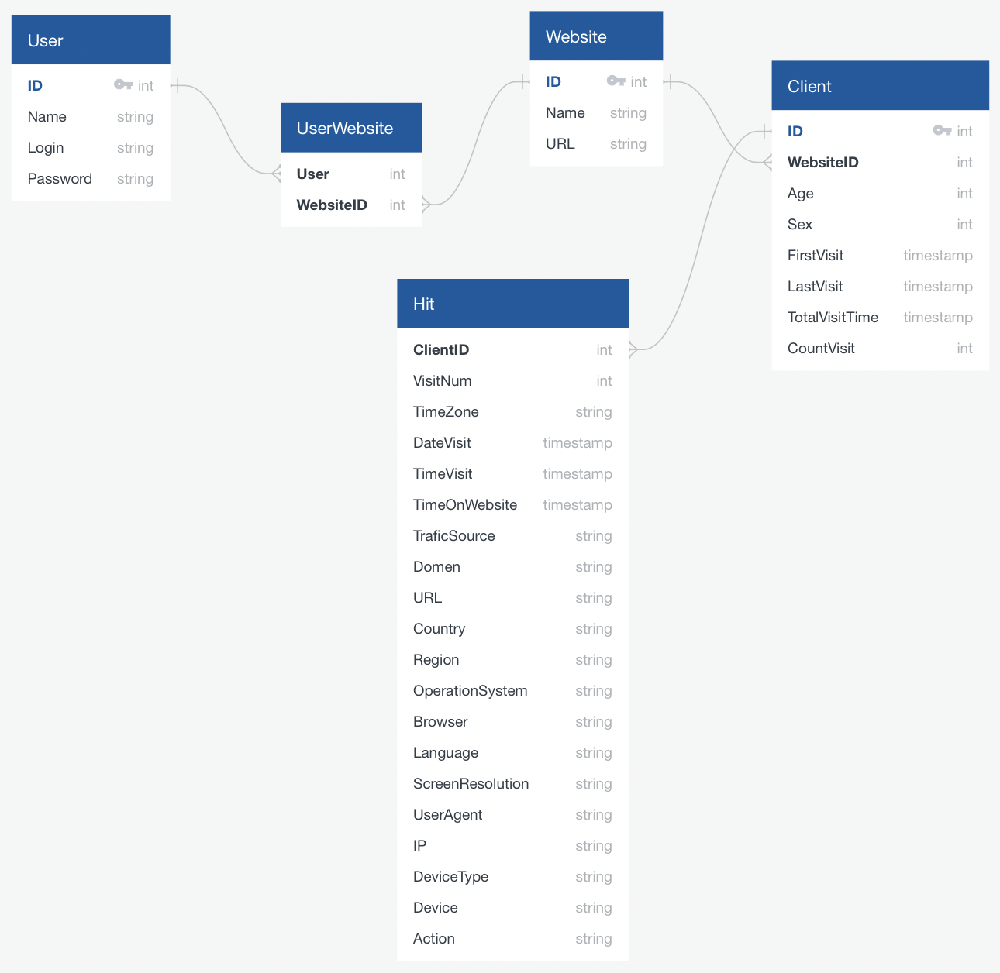
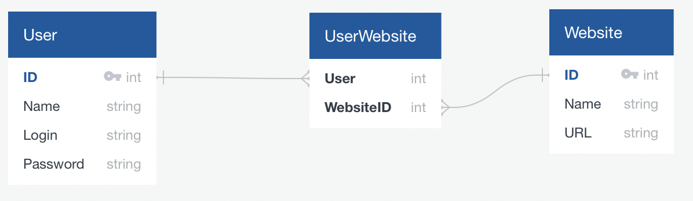
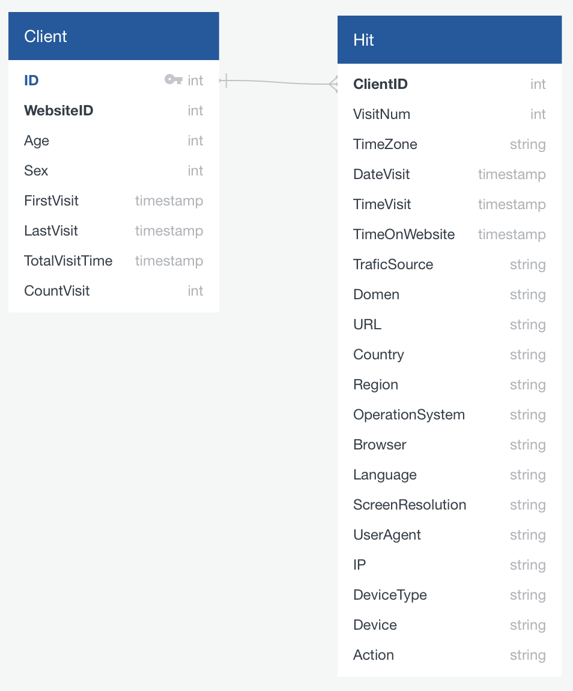
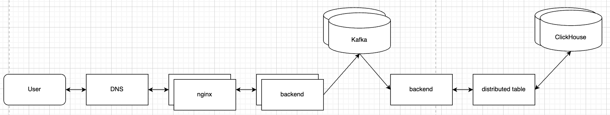

# Тема проекта - Яндекс Метрика

## 1. Тема и целевая аудитория

### MVP

1. Сбок метрик сайта (сырые метрики без отчетов)

### Целевая аудитория

* У Яндекс Метрики целевая аудитория - владельцы сайтов, которые хотят собирать статистику.
* Яндекс Метрика установлена на 6.7 % всех сайтов в интернете. [На 2020 в интернете примерно 1.8 млд сайтов](https://sdvv.ru/articles/elektronnaya-kommertsiya/statistika-interneta-2020-sayty-domeny-khosting-trafik/), значит Яндекс Метрика установлена примерно на 120 млн сайтов.
* Сервисом пользуются по всему миру. В основном используют в Европе и РФ [3 по популярности система веб аналитики в Европе](https://w3techs.com/technologies/details/ta-yandexmetrika)

## 2. Расчет нагрузки

### Продуктовые метрики

1. **Количество сайтов** - 120 млн
2. **Средний размер хранилища пользователя** - за пользователя будем считать владельца сайта. Метриками сайта - будем считать информацию о клиентах и их посещений. Для удобства метрики клиента будем считать в хитах.

    * Профиль и информация о сайте имеют очень малый размер, ими можно принебречь.

3. **Средний размер хранилища клиента**
    * Информация о клиенте

    | Общие данные               | Размер |
    | -------------------------- | ------ |
    | ClienID                    | 5 Б    |
    | Возраст                    | 5 Б    |
    | Пол                        | 5 Б    |
    | Первый визит               | 10 Б   |
    | Последний визит            | 10 Б   |
    | Количество визитов         | 5 Б    |
    | Общее время на сайте       | 10 Б   |
    | **Общий размер**           | 50 Б   |

    * Информация о клиенте за 1 хит

    | Данные каждого хита   | Размер |
    | --------------------- | ------ |
    | ClienID               | 10 Б   |
    | Номер визита          | 10 Б   |
    | Таймзона              | 10 Б   |
    | Дата визита           | 10 Б   |
    | Время визита          | 10 Б   |
    | Время на сайте        | 10 Б   |
    | Источник трафика      | 10 Б   |
    | Домен                 | 10 Б   |
    | URL                   | 10 Б   |
    | Страна                | 10 Б   |
    | Регион                | 10 Б   |
    | Операционная система  | 10 Б   |
    | Браузер               | 10 Б   |
    | Язык браузера         | 10 Б   |
    | Разрешение экрана     | 10 Б   |
    | User Agent            | 10 Б   |
    | IP                    | 10 Б   |
    | Тип устройства        | 10 Б   |
    | Модель устройства     | 10 Б   |
    | Событие               | 10 Б   |
    | Общий размер          | 200 Б  |

    Это не все метрики, которые приходят. Я выделил основные, болше данных можно посмотреть [тут](https://play.clickhouse.com). В среднем клиент на сайте совершает 1,5 хита в день. Подсчитаем нагрузку сайта за день.

    **Размер метрик за одни день**

    | Размер хита | Количество пользователей | Количество хитов | Общее хитов | Общий размер |
    | ----------- | ------------------------ | ---------------- | ----------- | ------------ |
    | 200 Б       | 50                       | 1,5              | 75          | 15 КБ        |

4. **Среднее количество действий пользователя**
    * Информация о действиях пользователя настолько мала, что мы можем ей принебречь (Авторизация, Регистрация, Регистрация сайта, Просмотр метрик).

5. **Среднее количество действий клиента**
    * Под действиями клиента понимаем заход на сайт, нажатие на кнопки, переход между страницами и тд. Все это метрики сайта. Для удобства действия клиентов будем считать в хитам не конкретизируя их. В среднем клиент совершает 1,5 хита в день. Cреднее количество клиентов 50, получаем 75 хитов в день.

### Технические метрики

1. **Размер хранения в разбивке по типам данных**
    * Информация о клиентах - мы посчитали, что информация о клиенте занимает 50Б. Среднее количество клиентов в день на сайте 200, будем считать что за все время количество уникальных пользователей было в 5 раз больше, тогда нам нужно `120 млн * 1000 * 50Б = 6 ТБ`
    * Метрики сайта - у нас 120 млн сайтов, Яндекс Метрика существует с 2009 года, то есть 12 лет. Так как раньше сайтов было меньше, то будем считать среднее количество сайтов за 12 лет 30 млн, тогда нам нужно `30 млн * 12 * 365 * 75 * 15 КБ = 150 ПБ`

    В ClickHouse используется сжатие данных для эффективного хранения данных. Для того, чтобы понять какое будет сжатие я загрузил [тестовый набор данных](https://clickhouse.com/docs/ru/getting-started/example-datasets/metrica/) Яндекс метрики размеров 8 ГБ. После загрузки в ClickHouse и оптимизаций таблица весила 520 МБ. Получается размер сжатия примерно 15 раз.

    * Сжатая информация о клиентах - `0,4 ТБ`
    * Сжатая метрика сайта - `10 ПБ`

2. RPS и трафик в секунду

    | Количество хитов в день | Размер хита | RPS    | Трафик  |
    | ----------------------- | ----------- | ------ | ------- |
    | 75                      | 15 КБ       | 100000 | 1,5 ГБ/C |

## 3. Логическая схема

Сущности:

* Пользователь (User)
* Вебсайт (Website)
* Вебсайты пользователя (UserWebsite)
* Клиент (Client)
* Визит клиента (Hit)



## 4. Физическая схема

Так как таблицы User, Website, UserWebsite не будут иметь небольшую нагрузку и будут обновляться достаточно редко, то будем их хранить в PostgreSQL. Таблица Hit, Client будут обновляться достаточно часто и в них будет храниться много данных, для них используем ClickHouse. Для сессий будем использовать Redis из-за того, что эти данные нам будут постоянно нужны и они храняться в оперативе. Для взаимодействия ClickHouse и PostgreSQL будем использовать [внешние словари](https://clickhouse.com/docs/ru/sql-reference/dictionaries/external-dictionaries/external-dicts-dict-sources/#dicts-external_dicts_dict_sources-postgresql)

У нас таблица Hit будет очень большой, поэтому будем ее шардировать между серверами. Плюс ClickHouse в том, что он из коробки поддерживает шардирование. У нас есть возможности шардировать таблицу внутри одного датацентра, так и между датацантрами. Будем использовать [distributed table](https://clickhouse.com/docs/ru/engines/table-engines/special/distributed/). Это прослойка, которая знает обо всех шардах и умеет общаяться с ними. Ключом шардирования сделаем домен сайта, чтобы все данные по сайту попытаться хранить в одном месте. Если нам не будет хватать скорости, то мы сможем увеличить количество сервером для distributed table и скорость возрастет. Подробная информация и метрики приведены [тут](https://habr.com/ru/post/509540/)

Разделим нашу логическую схему на следующие базы:

* PostgreSQL



* ClickHouse



## 5. Технологии

### Frontend

Как такового фронтенда метрик у нас не будет. Любой сайт, на котором установлены метрики будет нашим фронтендом метрки. Туда просто добавляется наш JS скрипт, который будет собирать данные и отправлять на бекенд.

### Backend

Бекенд митрик должен получать данные и передавать distributed table, который дальше уже будет распределять данные между шардами. Он может выполнять минимальные преобразования по данным.

### Трейсинг/Логгинг/Мониторинг

#### Трейсинг

* Для того, чтобы отслеживать где у нас упал запрос при похоже между бекендами будем использовать Jagger.

#### Логгинг

* Для логгирования бекенда будем использовать Graylog.

#### Мониторинг

* Для мониторинга бекенда будем использовать prometheus + grafana.

### Kubernetes

Для микросервисом мы будем использовать kubernetes. В нем легко можно поднять несколько сервисов и настроить балансировку между ними для распределения нагрузки.

## 6. Схема проекта



## 7. Список серверов

Найти точного географического распределения Яндекс Метрики не удалось, поэтому будем предполагать, что она очень популярна в странах СНГ, чуть менее популярна в Европе и США.
На основе этих данных расположим ДЦ:

* Россия - в центральной части, например в Москве
* Россия - ближе к Дальнему Востоку, например Красноярск
* США - в центре США, чтобы полностью покрыть, например Канзас-Сити
* Европа - в центре Европы, например в Вене

В каждом месте будем ставить по 2 ДЦ, основной и резервный.

Так как мы будем использовать kubernetes, то нам нужно рассчитать какая нагрузка ляжет на весь кластер. Для каждого контейнера мы можем выделить сколько нам нужно памяти, а kubernetes эффективно распределит их между подами.

Все данные будут рассмотрены на примере 1 ДЦ. Всего у нас 4 основных и 4 резервных. Резервные ДЦ полностю будут копировать основные, поэтому мы их не учитываем в подсчетах. Расчитаем нагрузку сервиса между 4 ДЦ.

```sh
Nginx = 100 000 rps
Backend = 100 000 rps
ClickHouse = 100 000 rps
PostgreSQL = 5 000 rps
```

Для работы ClickHouse нам нужно очень много постоянной памяти, чтобы хранить все хиты. Так же нам нужно много RAM и CPU, чтобы поддерживать сразу много соединений. По данным на 2017 год кластер Яндекс Метрики насчитывает [412 серверов](https://habr.com/ru/post/322724/) и 6 датацентров. Будем считать, что нам нужно 500 серверов.

| CPU (ядер) | RAM (ГБ) | HDD (ТБ) | Количество |
| ---------- | -------- | -------- | ---------- |
| 32         | 64       | 3 х 8    | 125        |

Для работы PostgreSQL нам нужно намного меньше дисков, но RAM и CPU тоже нужно достаточно много для параллельной работы.

| CPU (ядер) | RAM (ГБ) | HDD (ТБ) | Количество |
| ---------- | -------- | -------- | ---------- |
| 16         | 24       | 2 х 4    | 10         |

Nginx будет иметь огромную нагрузку из-за большого количества данных, поэтому нам нужно будет побольше RAM и CPU, но диска нам много не нужно.

| CPU (ядер) | RAM (ГБ) | SSD (ГБ) | Количество |
| ---------- | -------- | -------- | ---------- |
| 4          | 16       | 64       | 10         |

Сам наш бекенд не будет хранить данные, поэтому много памяти ему не нужно. Выделим много бекендов с меньшим количеством памяти для работы сервиса.

| CPU (ядер) | RAM (ГБ) | SSD (ТБ) | Количество |
| ---------- | -------- | -------- | ---------- |
| 24         | 64       | 64       | 30         |

## 8. Литература

1. <https://ru.wikipedia.org/wiki/Яндекс.Метрика>
2. <https://sdvv.ru/articles/elektronnaya-kommertsiya/statistika-interneta-2020-sayty-domeny-khosting-trafik/>
3. <https://w3techs.com/technologies/details/ta-yandexmetrika>
4. <https://play.clickhouse.com>
5. <https://clickhouse.com/docs/ru/getting-started/example-datasets/metrica/>
6. <https://habr.com/ru/post/322724/>
7. <https://habr.com/ru/post/509540/>
