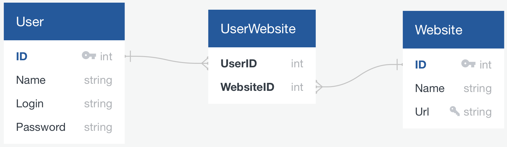
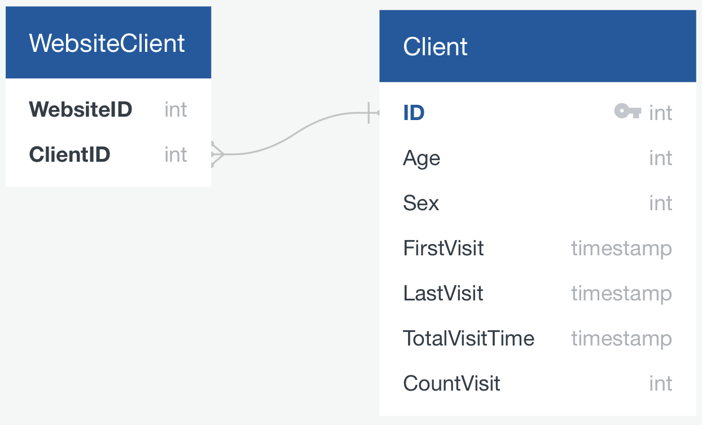
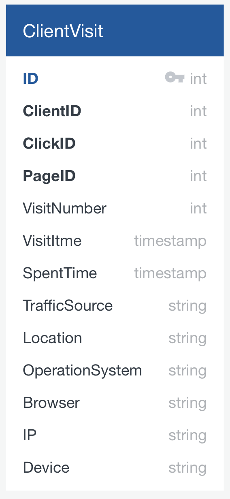
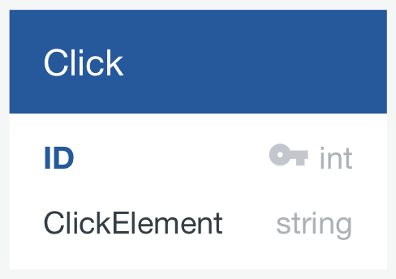
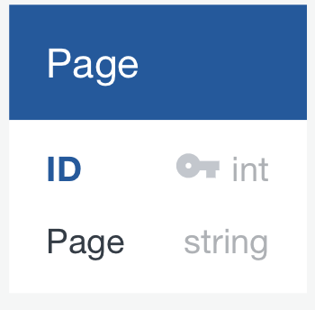

# Тема проекта - Яндекс Метрика

## 1. Тема и целевая аудитория

### MVP

1. Авторизация/регистрация
2. Регистрация сайта
3. Просмотр метрик сайта
4. Сбок метрик сайта (сырые метрики без отчетов)

### Целевая аудитория

* У Яндекс Метрики целевая аудитория - владельцы сайтов, которые хотят собирать статистику.
* Яндекс Метрика установлена на 6.7 % всех сайтов в интернете. [На 2020 в интернете примерно 1.8 млд сайтов](https://sdvv.ru/articles/elektronnaya-kommertsiya/statistika-interneta-2020-sayty-domeny-khosting-trafik/), значит Яндекс Метрика установлена примерно на 120 млн сайтов.
* [На 2020 интернетом пользуются 4.54 млд пользователей](https://sdvv.ru/articles/elektronnaya-kommertsiya/statistika-interneta-2020-sayty-domeny-khosting-trafik/), тогда пользователей Яндекс Метрики - 300 млн. В среднем количество пользователей в месяц в 5 раз больше, тогда в месяц аудитория примерно 1,5 млд.
* Сервисом пользуются по всему миру. В основном используют в Европе и РФ [3 по популярности система веб аналитики в Европе](https://w3techs.com/technologies/details/ta-yandexmetrika)

## 2. Расчет нагрузки

### Продуктовые метрики

1. **Месячная аудитория** - 1,5 млд
2. **Дневная аудитория** - 300 млн
3. **Средний размер хранилища пользователя** - за пользователя будем считать владельца сайта. Метриками сайта - будем считать информацию о клиентах и их посещений.
    * Профиль и информация о сайте имеют очень малый размер, ими можно принебречь

    * Информация о клиенте

    | Общие данные               | Размер |
    | -------------------------- | ------ |
    | ClienID                    | 5 Б    |
    | Возраст                    | 5 Б    |
    | Пол                        | 5 Б    |
    | Первый визит               | 10 Б   |
    | Последний визит            | 10 Б   |
    | Количество визитов         | 5 Б    |
    | Общее время на сайте       | 10 Б   |
    | **Общий размер**           | 50 Б   |

    * Информация о клиенте за 1 посещение

    | Данные каждого посещения   | Количество за 1 посещение | Размер |
    | -------------------------- | ------------------------- | ------ |
    | ClienID                    | 1                         | 5 Б    |
    | Номер визита               | 1                         | 5 Б    |
    | Время визита               | 1                         | 10 Б   |
    | Время на сайте             | 1                         | 10 Б   |
    | Источник трафика           | 1                         | 5 Б    |
    | Местоположение             | 1                         | 10 Б   |
    | Операционная система       | 1                         | 10 Б   |
    | Браузер                    | 1                         | 5 Б    |
    | IP                         | 1                         | 5 Б    |
    | Тип устройства             | 1                         | 10 Б   |
    | Информация о клике         | 10                        | 50 Б   |
    | Посещенная страница        | 5                         | 25 Б   |
    | Общий размер               |                           | 150 Б  |

    В среднем на сайт клиент заходит 5 раз в день. Возьмем количество клиентов на сайте за день 1000.
    **Размер метрик за одни день**

    | Размер клиента за посещение | Количество посещений клиента | Количество клиентов | Размер |
    | --------------------------- | ---------------------------- | ------------------- | ------ |
    | 150 Б                       | 5                            | 1000                | 0.7 Мб |

4. **Среднее количество действий пользователя**
    * Авторизация - если у сайта стоит кука на 1 день, то среднее количество будет 1 запрос в день
    * Регистрация - пользователь регистрируется 1 раз на сайте, поэтому будет 0 запросов в день
    * Регистрация сайта - обычно пользователь регистрирует 1 сайт на учетную запись, поэтому будет 0 запросов в день
    * Просмотр информации о сайте - владельцы маленьких сайтов реже просматривают информацию, владельцы крупных постоянно сидят и изучают метрики. Будем считать, что происходит где-то 10 запросов в день.

    | Действие                    | Количество запросов |
    | --------------------------- | ------------------- |
    | Авторизация                 | 1                   |
    | Регистрация                 | 0                   |
    | Регистрация на сайте        | 0                   |
    | Просмотр информации о сайте | 10                  |
    | Общее количество            | 11                  |

5. **Среднее количество действий клиента**
    * Заход на сайт - мы посчитали, что клиент заходит примерно 5 раз в день, получается 5 запросов в день
    * Нажатие на кнопку - мы посчитали, что во время посещения сайта клиент нажимает на кнопки примерно 10 раз, получается 50 запросов в день
    * Переход на другую страницу - мы посчитали, что клиент во время посещения сайта переходит между 5 страницами, получается 25 запросов в день.
    * Уход с сайта - учитывая, что клиент посещает сайт примерно 5 раз в день, получаем 5 запросов в день

    | Действие                    | Количество запросов |
    | --------------------------- | ------------------- |
    | Заход на сайте              | 5                   |
    | Нажатие на кнопку           | 50                  |
    | Переход на другую страницу  | 25                  |
    | Уход с сайта                | 5                   |
    | Общее количество            | 85                  |

### Технические метрики

1. **Размер хранения в разбивке по типам данных**
    * Информация о клиентах - мы посчитали, что информация о клиенте занимает 50Б, будем считать, что среднее количество клиентов у нас 10000, тогда нам нужно `120 млн * 10000 * 50Б = 55 ТБ`
    * Метрики сайта - у нас 120 млн сайтов, Яндекс Метрика существует с 2009 года, то есть 12 лет. Так как раньше сайтов было меньше, то будем считать среднее количество сайтов за 12 лет 30 млн, тогда нам нужно `30 млн * 12 * 365 * 15 МБ = 1800 ПБ`

2. Сетевой трафик **Пиковое потребление в теченнии суток**
    * Просмотр информации о сайте - будем считать, что в среднем просматривать информацию будут 10 раз в день. При получении информации о сайте нам отдается не вся информация, а ее сжатые данные. Будем считать, что за раз нам приходит 100 кБ информации.

    | Количество действий пользователя | Размер | Количество сайтов | **Общий объем** |
    | -------------------------------- | ------ | ----------------- | --------------- |
    | 10                               | 100 кБ | 120 млн           | 11 ТБ           |

    * Заход на сайт

    | Количество действий пользователя | Размер | Количество клиентов | **Общий объем** |
    | -------------------------------- | ------ | ------------------- | --------------- |
    | 10                               | 30 Б   | 300 млн             | 83 ГБ           |

    * Нажатие на кнопку

    | Количество действий пользователя | Размер | Количество клиентов | **Общий объем** |
    | -------------------------------- | ------ | ------------------- | --------------- |
    | 100                              | 30 Б   | 300 млн             | 0.8 ТБ          |

    * Переход на другую страницу

    | Количество действий пользователя | Размер | Количество клиентов | **Общий объем** |
    | -------------------------------- | ------ | ------------------- | --------------- |
    | 50                               | 30 Б   | 300 млн             | 0.4 ТБ          |

    * Уход с сайта

    | Количество действий пользователя | Размер | Количество клиентов | **Общий объем** |
    | -------------------------------- | ------ | ------------------- | --------------- |
    | 10                               | 30 Б   | 300 млн             | 83 ГБ           |

3. RPS и трафик в секунду

    | Действие                    | Трафик   | RPS     |
    | --------------------------- | -------- | ------- |
    | Просмотр информации о сайте | 133 МБ/C | 13888   |
    | Заход на сайт               | 1 МБ/C   | 34722   |
    | Нажатие на кнопку           | 9 МБ/C   | 347222  |
    | Переход на другую страницу  | 5 МБ/C   | 173611  |
    | Уход с сайта                | 1 МБ/C   | 34722   |
    | **Итог**                    | 163 МБ/C | 604165  |

## 3. Логическая схема

Сущности:

* Пользователь
* Вебсайт
* Вебсайты пользователя
* Клиент
* Визит клиента
* Клиенты вебсайта

## 4. Физическая схема

Выберем базу данных ClickHouse. Цель Яндекс метрики быстро пользователю отдать какую-то статистику, например количество пользователей из Бразилии. ClickHouse - столбцовая СУБД, то есть там данные храняться по столбцам, а не по строкам, как в обычных СУБД типа PostgreSQL. Столбцовое хранение данных позволяет нам быстро получить нужные нам данные и производить операции над ними.

У нас будет очень много данных, для того, чтобы у нас хватило места под наши данные и база работала быстро разобьем ее на шарды:

* Пользователи и вебсайты

* Клиенты

* Визиты клиентов

* Клики

* Страницы

## 5. Технологии

## 6. Схема проекта

## 7. Список серверов

## 8. Литература

1. <https://ru.wikipedia.org/wiki/Яндекс.Метрика>
2. <https://sdvv.ru/articles/elektronnaya-kommertsiya/statistika-interneta-2020-sayty-domeny-khosting-trafik/>
3. <https://w3techs.com/technologies/details/ta-yandexmetrika>
